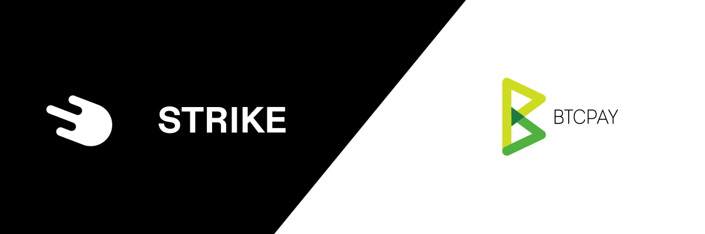
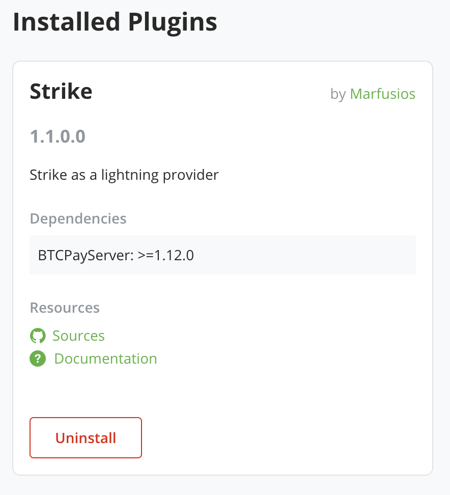

# Strike BTCPayServer Plugin

It allows using [Strike Wallet](https://strike.me) account as the lightning provider for the BTCPay Server.

[Releases and breaking changes](https://github.com/Marfusios/strike-btcpayserver-plugin/releases)

### License: 
    MIT

### Features

- Receiving lightning payments directly to Strike Wallet
- BTC price hedge - settlement into fiat currency
- Lightning Network liquidity managed by Strike

### Usage

- Visit [Strike Dashboard](https://dashboard.strike.me/login) and obtain API key. Select all scopes under **Account**, **Receiving payments** and **Rates**.
- Optionally select scopes under **Sending payments** to enable payments triggered by BTCPayServer (payouts, BOLT cards, etc.) 

> :warning: **Owner of this BTCPayServer instance can access your API key.** 
> Therefore they could spend your Strike balance if **Sending payments** scopes are selected


- Install Strike plugin from `Manage Plugins` page (or ask BTCPayServer admin)



- Then go to `BTCPayServer > Lightning > Settings > "Change connection" > "Use custom node"` and configure Strike connection. Follow this format: 

    ```
    type=strike;currency=FIAT;api-key=xxx
    ```

    Where xxx is your API key. 
    Select **FIAT** if you want to automatically convert received bitcoins into fiat currency. Otherwise choose **BTC**.


**Pull Requests are welcome!**
